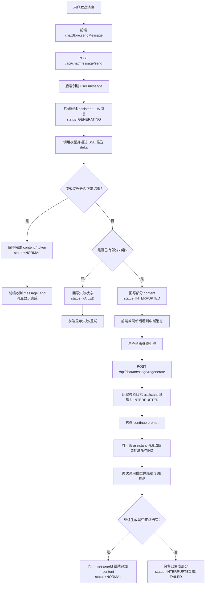
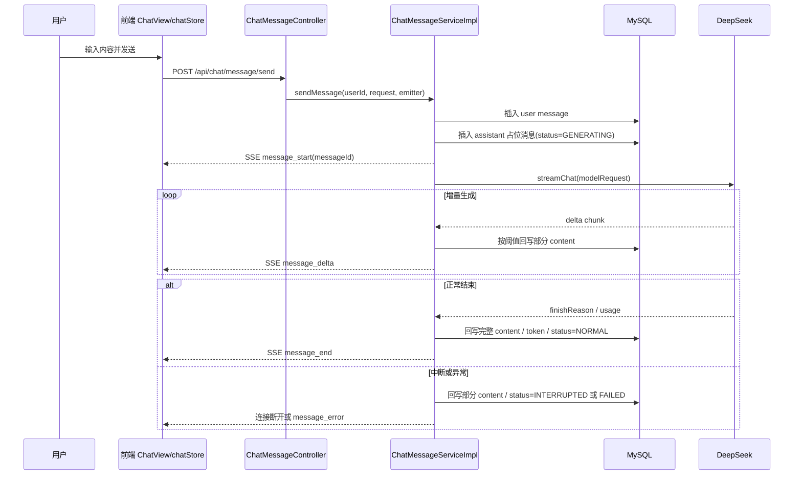
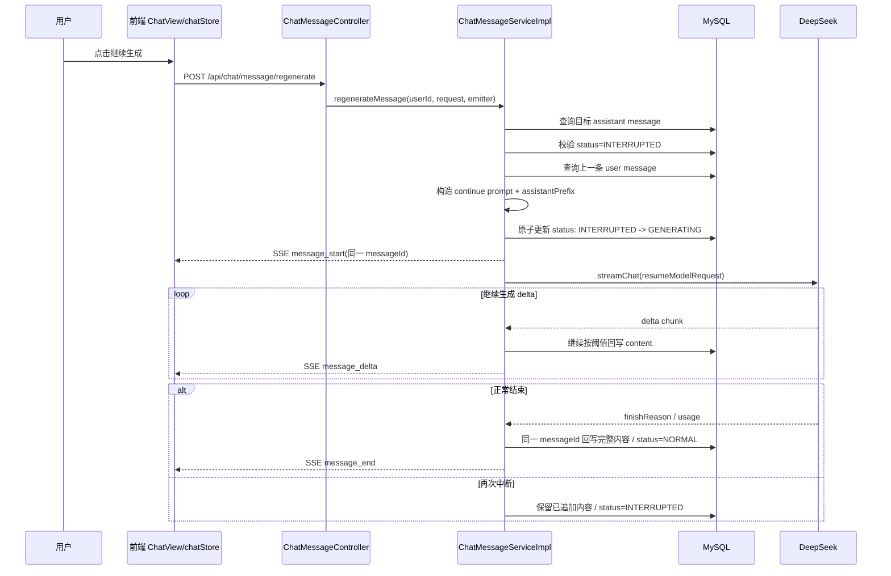
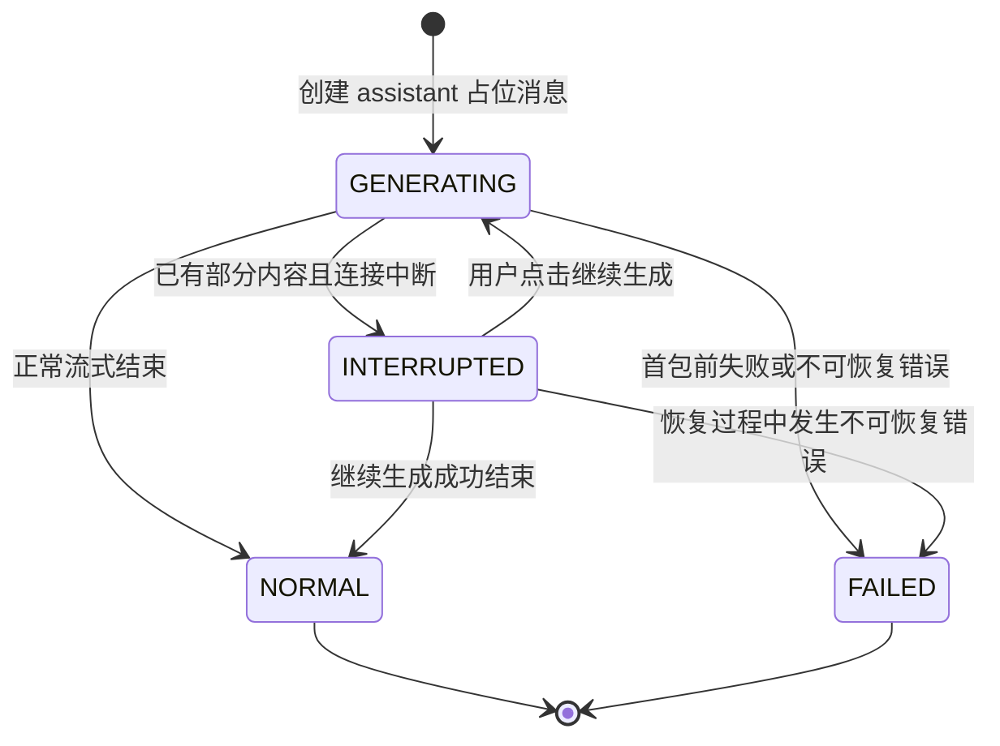
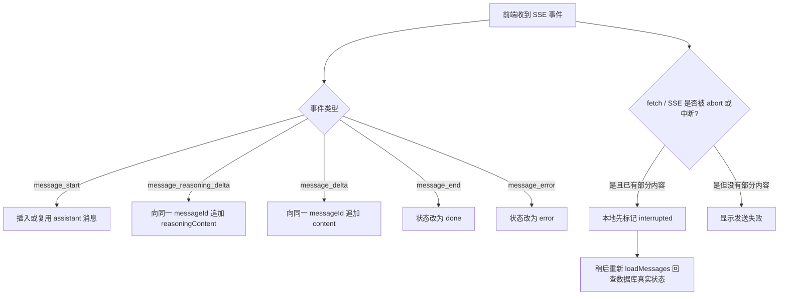
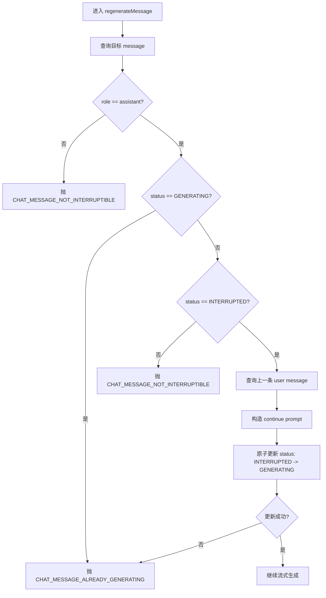

# 聊天响应中断后继续流程图

最后更新：2026-05-20

## 说明

本文档用于补充 [chat-response-resume-design.md](/Users/ccy/CcyProjects/ai-code-gpt-plus/docs/backend/chat-response-resume-design.md) 的流程图视角，帮助快速理解“发送消息 -> 流式生成 -> 中断 -> 继续生成”的完整链路。

适用场景：

- 联调前快速对齐前后端职责
- 排查“为什么中断后不能继续生成”
- 新同学快速理解 `send / regenerate / SSE / message status` 关系

## 1. 总览流程

## 2. 首次发送消息时序图

## 3. 中断后继续生成时序图

## 4. 消息状态流转图

## 5. 前端处理分支图

## 6. 后端关键决策点

## 7. 和代码的对应关系

| 流程节点 | 代码位置 |
| --- | --- |
| 首次发送消息入口 | [ChatMessageController.java](/Users/ccy/CcyProjects/ai-code-gpt-plus/gpt-plus-core/src/main/java/com/example/aichat/modules/chat/controller/ChatMessageController.java:57) |
| 继续生成入口 | [ChatMessageController.java](/Users/ccy/CcyProjects/ai-code-gpt-plus/gpt-plus-core/src/main/java/com/example/aichat/modules/chat/controller/ChatMessageController.java:74) |
| 首次发送和异步流式执行 | [ChatMessageServiceImpl.java](/Users/ccy/CcyProjects/ai-code-gpt-plus/gpt-plus-core/src/main/java/com/example/aichat/modules/chat/service/impl/ChatMessageServiceImpl.java:123) |
| 中断后继续生成主逻辑 | [ChatMessageServiceImpl.java](/Users/ccy/CcyProjects/ai-code-gpt-plus/gpt-plus-core/src/main/java/com/example/aichat/modules/chat/service/impl/ChatMessageServiceImpl.java:171) |
| 部分内容回写和中断状态落库 | [ChatMessageServiceImpl.java](/Users/ccy/CcyProjects/ai-code-gpt-plus/gpt-plus-core/src/main/java/com/example/aichat/modules/chat/service/impl/ChatMessageServiceImpl.java:516) |
| 前端流式消费和 abort | [chat.ts](/Users/ccy/CcyProjects/ai-code-gpt-plus/gpt-plus-web/src/stores/chat.ts:365) |
| 前端继续生成按钮和停止生成按钮 | [ChatView.vue](/Users/ccy/CcyProjects/ai-code-gpt-plus/gpt-plus-web/src/views/ChatView.vue:204) |

## 8. 阅读建议

- 如果你要看整体设计，先读本文件，再读 [chat-response-resume-design.md](/Users/ccy/CcyProjects/ai-code-gpt-plus/docs/backend/chat-response-resume-design.md:1)。
- 如果你要开始联调，优先看 [api-test-cases.md](/Users/ccy/CcyProjects/ai-code-gpt-plus/docs/backend/api-test-cases.md:308)。
- 如果你要改实现细节，重点对照 [ChatMessageServiceImpl.java](/Users/ccy/CcyProjects/ai-code-gpt-plus/gpt-plus-core/src/main/java/com/example/aichat/modules/chat/service/impl/ChatMessageServiceImpl.java:171) 和 [chat.ts](/Users/ccy/CcyProjects/ai-code-gpt-plus/gpt-plus-web/src/stores/chat.ts:365)。
